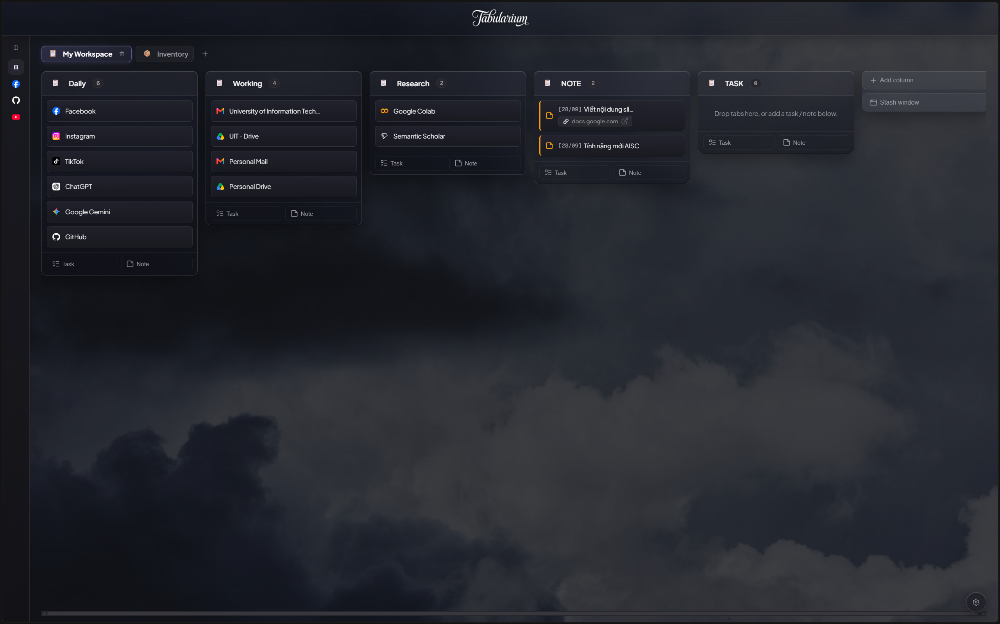

# Tabularium

**Tabularium** turns your browser's default New Tab page into a calm, minimalist Kanban workspace designed for **deep focus** and **peak productivity**.

Instead of letting dozens of scattered tabs clutter your browser, drain system memory, and break your concentration, Tabularium provides an orderly digital archive. File your tabs away as visual cards, capture quick tasks and detailed notes in a spacious drawer, and organize your work into dedicated boards without ever losing context.

---

<p align="center">
  
</p>

---

## Key Features

- 🏛️ **Visual Kanban Dashboard** — Organize open tabs, tasks, and notes into flexible columns and dedicated project boards.
- ⚡ **Fast Note & Instant Capture** — Press `Alt+N` on any webpage to quickly capture a note or task, or `Alt+S` (`Cmd+Shift+S` on macOS) to instantly stash the active tab.
- 📝 **Dedicated Note & Task Drawer** — Write in-depth notes, view attached web links, and export directly as `.md` files.
- 🚀 **100% Local-First & Zero Tracking** — All data is safely stored on your machine in IndexedDB. Instant load times, zero network requests, and complete privacy.
- 🎨 **Calm Aesthetic & Custom Wallpapers** — Minimalist dark and light themes, custom wallpaper support, and smooth keyboard navigation.

---
## Usage

### 1. Clone & Build

Make sure you have **Node.js 20+** and **npm** installed.

```bash
git clone https://github.com/BaryuH/Tabularium.git
cd Tabularium
npm install
npm run build
```

This generates the ready-to-use extension in the `dist/` directory.

### 2. Load Unpacked in Your Browser

Works on **Google Chrome**, **Brave**, **Microsoft Edge**, and any Chromium-based browser:

1. Open your browser and navigate to `chrome://extensions` (or `brave://extensions`, `edge://extensions`).
2. Toggle on **Developer mode** in the top-right corner.
3. Click the **Load unpacked** button in the top-left corner.
4. Select the `dist/` folder inside the `Tabularium` repository.
5. Open a new tab and start organizing with clarity.

> **Tip**: Press `Alt+N` on any web page to quickly capture a **Fast Note**, or `Alt+S` (or `Cmd+Shift+S` on macOS) to instantly save your current tab to your workspace.

---

## Support

If Tabularium helps you declutter your browser, stay focused, and boost your daily workflow, please consider giving it a **star ⭐ on GitHub**!

Your star helps others discover the project and supports continued development.
